# 02 — Documento de Diseño

**Proyecto:** DocuIntel — Sistema Inteligente de Gestión y Análisis Documental
**UTS — Desarrollo de Aplicaciones Empresariales — VI semestre**

---

## 1. Arquitectura general

Aplicación web en tres capas + capa de IA desacoplada:

- **Frontend (SPA):** React 18 + TypeScript + Vite + Tailwind. Consume solo
  `/api/v1`. Autenticación por token en `localStorage` con interceptor Axios.
- **Backend (API):** FastAPI. Routers por dominio (auth, users, repositories,
  documents, search, conversations, dashboard, audit-logs), servicios de
  negocio, y worker de pipeline (hilo embebido o proceso aparte).
- **Datos:** SQLAlchemy 2 + Alembic. SQLite en desarrollo, PostgreSQL en el
  perfil de producción (ADR-002). Binarios en almacenamiento de archivos
  (sistema de archivos abstraído; claves UUID), nunca en la BD.
- **IA:** interfaz `AIProvider` con implementaciones `openai`, `ollama` y
  `deterministic` (ADR-005), seleccionada por configuración.

### 1.1 Diagrama de contexto

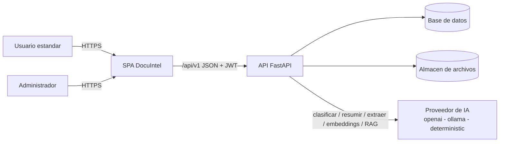

### 1.2 Diagrama de contenedores

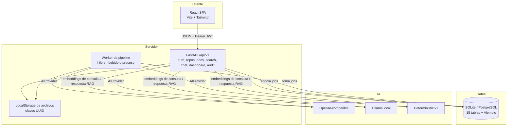

### 1.3 Diagrama de componentes (backend)

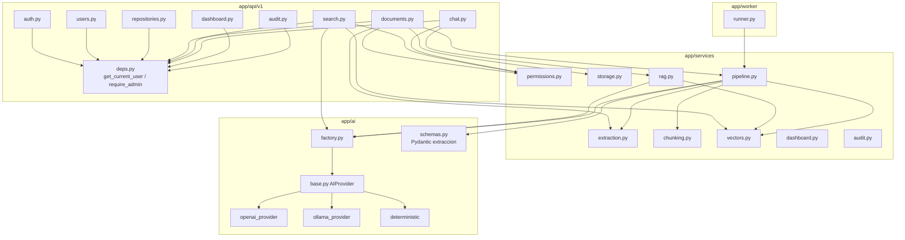

## 2. Diagrama de casos de uso

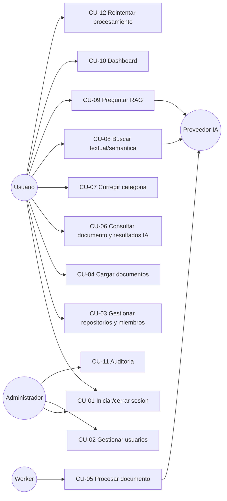

## 3. Diagramas de secuencia

### 3.1 Inicio de sesión

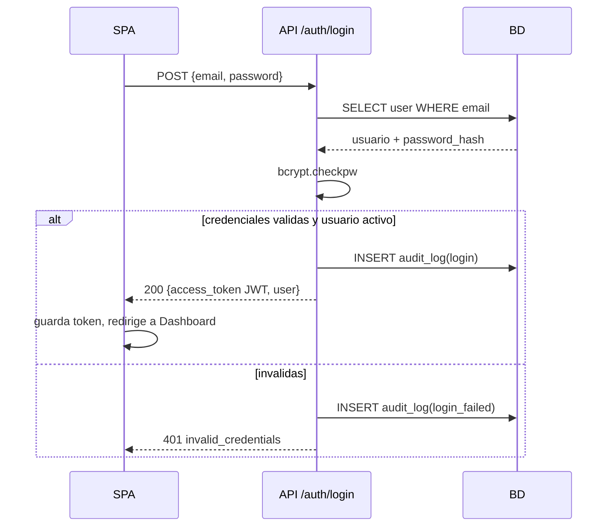

### 3.2 Carga y procesamiento

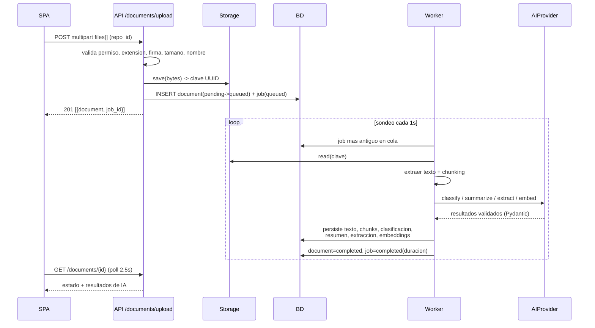

### 3.3 Búsqueda semántica

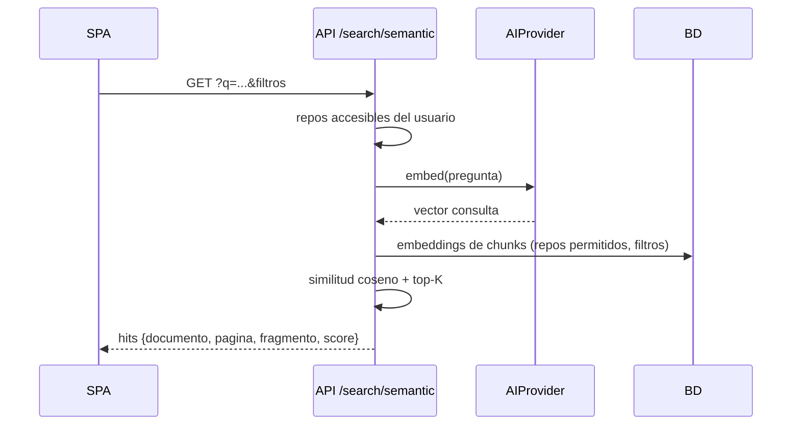

### 3.4 Pregunta RAG

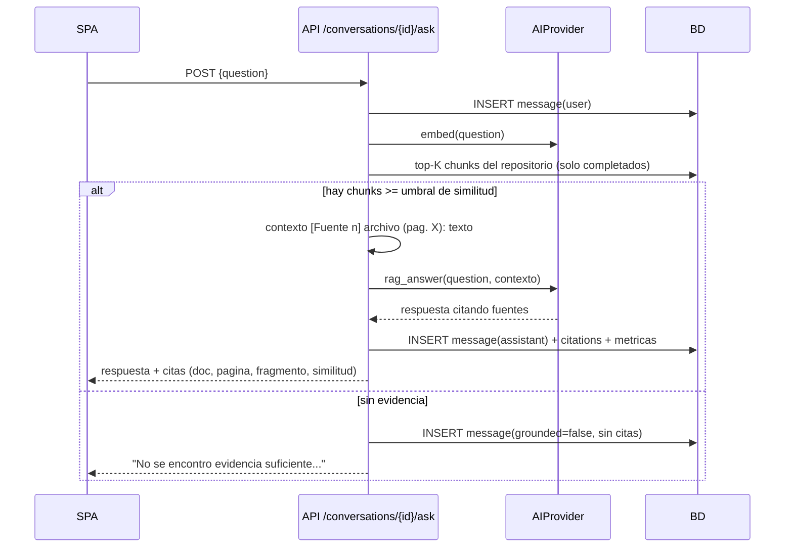

### 3.5 Reintento después de error

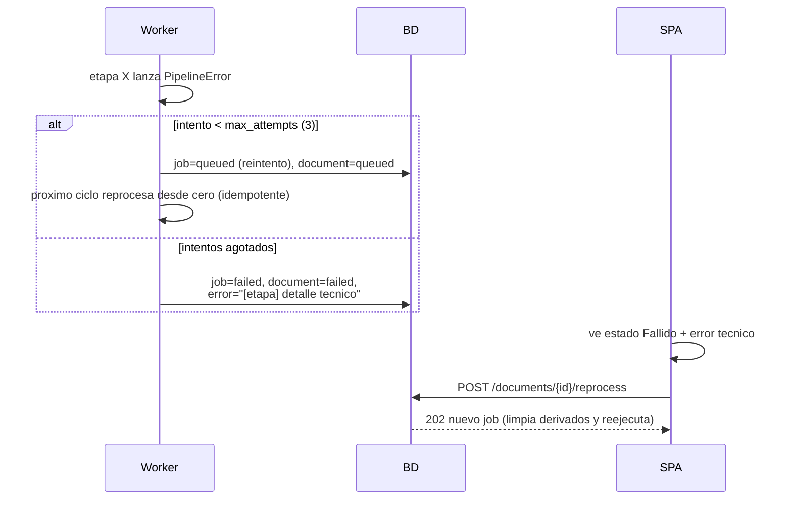

## 4. Modelo entidad-relación

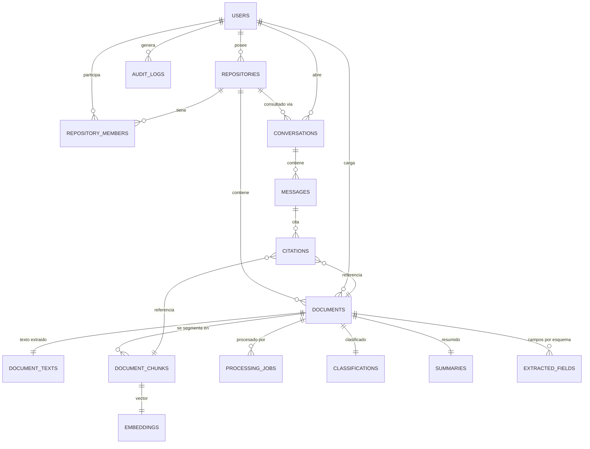

## 5. Diccionario de datos

Claves: PK = primaria, FK = foránea, UQ = única, IX = indexada. Todas las
tablas con FK usan `ON DELETE CASCADE` salvo donde se indica.

**users** — cuentas del sistema
| Columna | Tipo | Restricción | Descripción |
|---|---|---|---|
| id | INTEGER | PK | Identificador |
| email | VARCHAR(255) | UQ, IX | Correo (minúsculas) |
| full_name | VARCHAR(255) | NOT NULL | Nombre completo |
| password_hash | VARCHAR(255) | NOT NULL | Hash bcrypt |
| role | VARCHAR(20) | CHECK admin/user | Rol global |
| is_active | BOOLEAN | NOT NULL | Login habilitado |
| created_at / updated_at | DATETIME | NOT NULL | Auditoría de fila |

**repositories** — espacios de trabajo
| id | INTEGER | PK | |
| name | VARCHAR(150) | NOT NULL | Nombre visible |
| description | TEXT | NOT NULL ('' ) | Descripción |
| owner_id | INTEGER | FK users, IX | Propietario |
| created_at / updated_at | DATETIME | | |

**repository_members** — membresías
| id | INTEGER | PK | |
| repository_id | INTEGER | FK, IX | |
| user_id | INTEGER | FK, IX | |
| role | VARCHAR(20) | CHECK owner/member | Rol en el repositorio |
| (repository_id, user_id) | | UQ | Sin duplicados |

**documents** — metadatos de archivos
| id | INTEGER | PK | |
| uuid | VARCHAR(36) | UQ, IX | Identificador externo |
| repository_id | INTEGER | FK, IX | |
| uploaded_by | INTEGER | FK users, IX | |
| original_filename | VARCHAR(255) | NOT NULL | Nombre saneado |
| storage_key | VARCHAR(255) | UQ | Clave UUID en el almacén |
| file_type | VARCHAR(10) | CHECK pdf/docx/txt | |
| mime_type | VARCHAR(100) | NOT NULL | |
| size_bytes | INTEGER | NOT NULL | |
| status | VARCHAR(20) | CHECK 5 estados, IX | pending/queued/processing/completed/failed |
| error_message | TEXT | '' | Último error técnico |
| page_count | INTEGER | 0 | Páginas detectadas |

**document_texts** — texto completo extraído (1:1)
| document_id | INTEGER | FK UQ | | content TEXT | char_count INTEGER |

**document_chunks** — fragmentos indexables
| id | PK | | document_id | FK, IX | | chunk_index | INTEGER, UQ con doc |
| content | TEXT | | page_number | INTEGER | | start_char / end_char | INTEGER |

**embeddings** — vectores por chunk (1:1)
| chunk_id | FK UQ | | model | VARCHAR(100) | | dim | INTEGER | | vector | BLOB float32 |

**processing_jobs** — cola y trazabilidad del pipeline
| id | PK | | document_id | FK, IX | | job_type | 'full_pipeline' |
| status | CHECK queued/running/completed/failed, IX | | stage | etapa actual/fallida |
| attempt / max_attempts | INTEGER | | error_message | TEXT |
| started_at / finished_at | DATETIME NULL | | duration_ms | INTEGER |

**classifications** — categoría por documento (1:1)
| document_id | FK UQ | | predicted_category | VARCHAR(30) | | confidence | FLOAT |
| model | VARCHAR(100) | | manual_category | VARCHAR(30) NULL | corrección |
| corrected_by | FK users ON DELETE SET NULL | | corrected_at | DATETIME NULL |

**summaries** — resumen por documento (1:1)
| document_id | FK UQ | | content | TEXT | | model | VARCHAR(100) |

**extracted_fields** — datos estructurados por esquema
| document_id | FK, IX | | schema_name | invoice/contract/resume, UQ con doc |
| data | TEXT JSON validado | | model | VARCHAR(100) |

**conversations / messages / citations** — chat RAG
| conversations: id PK, repository_id FK IX, user_id FK IX, title |
| messages: id PK, conversation_id FK IX, role CHECK user/assistant, content, model, latency_ms, chunk_count, grounded BOOL |
| citations: id PK, message_id FK IX, document_id FK, chunk_id FK, snippet, similarity FLOAT, page_number |

**audit_logs** — auditoría
| id PK | user_id FK SET NULL, IX | action VARCHAR(60) | entity_type/entity_id |
| detail TEXT | ip_address VARCHAR(45) | created_at DATETIME IX |

## 6. Diseño de la API

Prefijo `/api/v1`, JSON, Bearer JWT. Contratos completos en Swagger
(`/api/docs`) y colección `docs/api-collection.postman.json`.

| Recurso | Endpoints |
|---------|-----------|
| Auth | POST /auth/login, POST /auth/logout, GET /auth/me |
| Usuarios (admin) | GET/POST /users, PATCH /users/{id} |
| Repositorios | GET/POST /repositories, GET/PATCH/DELETE /repositories/{id}, GET .../stats, GET/POST .../members, DELETE .../members/{id} |
| Documentos | POST /documents/upload?repository_id, GET /documents (filtros+paginación), GET/DELETE /documents/{id}, GET .../content, GET .../download, POST .../reprocess, GET .../jobs, PATCH .../category |
| Búsqueda | GET /search/text, GET /search/semantic |
| RAG | GET/POST /conversations, GET/DELETE /conversations/{id}, POST .../ask |
| Dashboard | GET /dashboard |
| Auditoría (admin) | GET /audit-logs |
| Salud | GET /health (sin auth) |

Formato de error uniforme:

```json
{ "error": { "code": "forbidden", "message": "No tiene acceso a este repositorio",
             "correlation_id": "ab12cd34ef56" } }
```

Códigos usados: 200/201/202/204, 400 (validación de negocio), 401, 403, 404,
409 (conflicto), 413 (tamaño), 422 (validación de esquema), 503 (IA no
disponible), 500 (con correlation_id, sin detalles internos).

## 7. Flujo documental

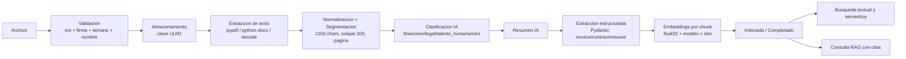

## 8. Diseño de la integración con IA

| Aspecto | Valor |
|---------|-------|
| Contrato | `AIProvider`: classify, summarize, extract, embed, rag_answer |
| Proveedor por defecto | `deterministic` (offline, reproducible, visible como `deterministic-v1`) |
| Proveedor LLM | OpenAI-compatible — chat `gpt-4o-mini`, embeddings `text-embedding-3-small` |
| Proveedor local | Ollama — `llama3.1` + `nomic-embed-text` (768d) |
| Dimensión vector | 384 (openai con `dimensions`/deterministic), 768 (ollama); guardada por embedding |
| Chunking | 1200 caracteres, solapamiento 200, corte preferente en párrafo/oración, mapeo a página |
| Métrica | Similitud coseno |
| Top-K | 6 (RAG), 10 (búsqueda), configurables |
| Umbral de evidencia | RAG_MIN_SIMILARITY=0.15 → debajo: "sin evidencia suficiente" |
| Contexto RAG | Bloques `[Fuente n] archivo (pág. X): texto`, respuesta obligada a citar |
| Reducción de alucinación | Solo contexto recuperado, instrucción estricta, umbral, frase estándar de no-evidencia, citas verificables en UI |
| Registro | Latencia, nº fragmentos y modelo por respuesta; errores de proveedor en logs sin secretos |
| Privacidad | Con proveedor externo, los textos salen al servicio configurado — documentado en manual técnico; alternativa local (Ollama) y offline (deterministic) |
| Justificación | ADR-005 |

## 9. Diseño de interfaz (wireframes implementados)

Las 12 pantallas siguen un patrón común: encabezado con navegación,
contenido en tarjetas, estados de carga/vacío/error, confirmaciones para
acciones destructivas y notificaciones tipo toast. Wireframes textuales:

```
LOGIN                          DASHBOARD
+----------------------+       +------------------------------------------+
|      [DI] DocuIntel  |       | KPIs: repos | docs | procesados | fallidos|
|  Correo [_________]  |       | [Categoria][Formato][Estado] (barras)    |
|  Clave  [_________]  |       | [Tendencia 14 dias  ▂▄▆█▄▂]              |
|  [ Iniciar sesion ]  |       | [Actividad reciente] [Errores recientes] |
+----------------------+       +------------------------------------------+

REPOSITORIO (detalle)          DOCUMENTO (detalle)
+---------------------------+  +----------------------------------------+
| Nombre  [Editar][Eliminar]|  | archivo.pdf [Descargar][Reproc][Elim]  |
| KPIs: docs/compl/fall/MB  |  | Estado | Categoria(conf/modelo) | Info |
| [ Zona de carga drag&drop]|  | [Resumen IA]                           |
| Tabla docs + estados      |  | [Datos extraidos por esquema]          |
| Miembros | Consultar IA   |  | [Texto extraido] [Historial de jobs]   |
+---------------------------+  +----------------------------------------+

BUSCAR                         CHAT RAG
+---------------------------+  +----------------------------------------+
| [q________] [Buscar]      |  | Repo [v] [Nueva conv] | burbujas chat  |
| (Textual|Semantica) filtros|  | Historial            | respuesta +     |
| Resultados con resaltado  |  |                      | Fuentes citadas |
| doc/pagina/score          |  | [pregunta__________][Preguntar]        |
+---------------------------+  +----------------------------------------+
```

Capturas reales de la implementación en `evidence/screenshots/`.

## 10. Diseño de seguridad

- **Autenticación:** JWT HS256 firmado con `SECRET_KEY` (env), expiración
  configurable; bcrypt (12 rondas) para contraseñas.
- **Autorización:** dependencia `get_current_user` en toda ruta de negocio;
  `require_admin` para usuarios/auditoría; `permissions.py` centraliza la regla
  propietario/miembro/admin; toda consulta se filtra por repositorios accesibles.
- **Carga de archivos:** lista blanca de extensiones + verificación de firma
  binaria (%PDF-, PK\x03\x04, decodificación de texto), límite de tamaño,
  saneamiento del nombre (solo base name + caracteres seguros) y clave de
  almacenamiento UUID generada por el servidor → el nombre del usuario jamás
  toca una ruta.
- **Errores:** cuerpo uniforme con `correlation_id`; detalles técnicos solo en
  logs JSON del servidor.
- **CORS:** solo orígenes configurados; métodos y cabeceras explícitos.
- **Auditoría:** login (ok/fallido), logout, CRUD de repositorios/miembros,
  cargas, descargas, eliminaciones, reprocesos, correcciones, preguntas RAG y
  gestión de usuarios, con usuario, entidad, detalle e IP.
- **Secretos:** exclusivamente en `.env` (no versionado); el seed toma las
  credenciales iniciales del entorno.

## 11. Diagrama de despliegue

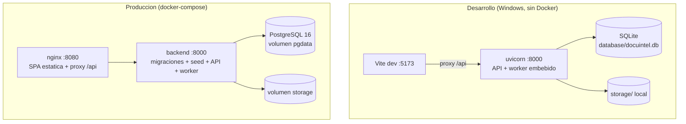

El perfil de producción está definido y documentado; la máquina de desarrollo
no tiene Docker, por lo que su validación en vivo queda como paso externo
(declarado en `docs/05-implementacion-y-despliegue.md`).

## 12. Decisiones tecnológicas

Resumen (detalle y alternativas en `docs/adr/`):

| Decisión | ADR |
|----------|-----|
| Monorepo FastAPI + React, IA desacoplada | ADR-001 |
| SQLite default + PostgreSQL producción | ADR-002 |
| Vectores BLOB + coseno NumPy (ruta pgvector) | ADR-003 |
| Cola en BD + worker embebido/independiente | ADR-004 |
| 3 proveedores IA, determinista honesto para pruebas | ADR-005 |
